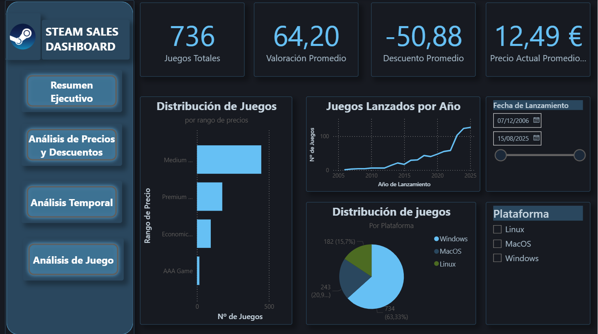
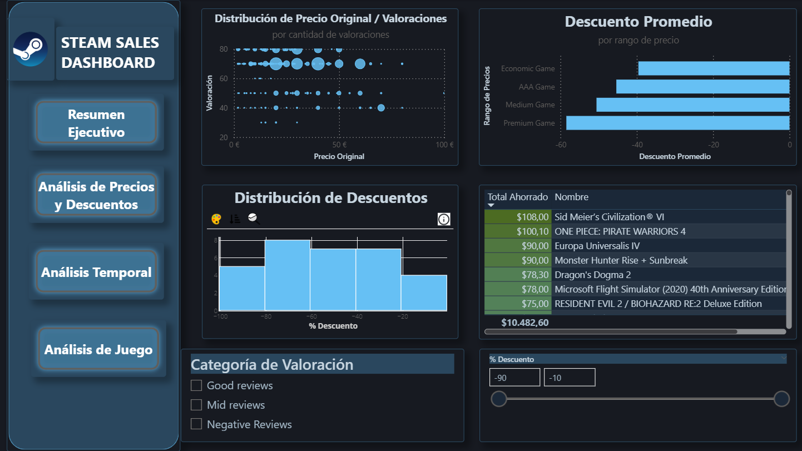
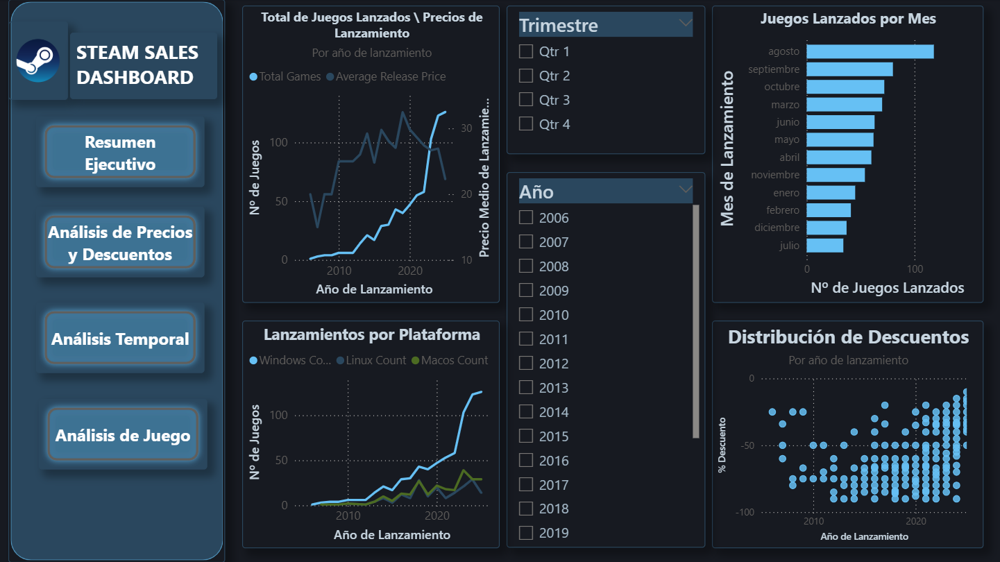
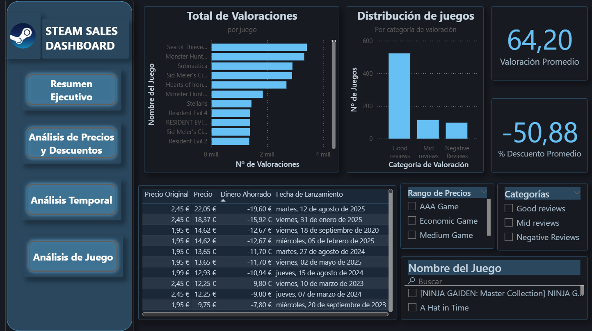

# 🎮 Steam Sales Analysis

## [Dataset](https://www.kaggle.com/datasets/benjaminlundkvist/steam-sales-historical-dataset)

Dashboard interactivo desarrollado en Power BI para el análisis del catálogo de juegos de Steam, focalizado en la estrategia de precios, descuentos, valoraciones y evolución temporal del mercado. El objetivo es extraer patrones de comportamiento comercial en la plataforma de distribución digital de juegos de PC más grande del mundo.

---

## 📋 Tabla de contenidos

- [Contexto del mercado](#-contexto-del-mercado)
- [Dataset](#-dataset)
- [Categorías calculadas](#-categor%C3%ADas-calculadas)
- [Preguntas analíticas](#-preguntas-anal%C3%ADticas)
- [Estructura del dashboard](#-estructura-del-dashboard)
- [Principales hallazgos](#-principales-hallazgos)
- [Estructura del repositorio](#-estructura-del-repositorio)
- [Tecnologías utilizadas](#-tecnolog%C3%ADas-utilizadas)

---
## Contexto del mercado

Steam es la plataforma de distribución digital de videojuegos dominante en PC, desarrollada por Valve Corporation. Ofrece a los usuarios funciones como instalación y actualización automática de juegos, guardado en la nube, transmisión de vídeo y herramientas sociales (lista de amigos, chat, servidores de juego multijugador). Es utilizada tanto por estudios independientes como por grandes compañías de la industria para distribuir videojuegos y contenido multimedia relacionado.

Su modelo de negocio incluye ventas a precio completo y descuentos ocasionales o periódicos a través de eventos estacionales, como verano o invierno, lo que genera fluctuaciones significativas en precios y visibilidad de títulos. Un aspecto clave de este dataset es que únicamente recoge datos de juegos que han tenido algún tipo de oferta en algún momento, por lo que no representa la totalidad del catálogo de Steam, dónde cualquier desarrollador puede publicar un título.

---
## 📊 Dataset

**Fuente:** [Kaggle — Steam Sales Historical Dataset](https://www.kaggle.com/datasets/benjaminlundkvist/steam-sales-historical-dataset)

El dataset proporciona un registro histórico detallado de ventas en Steam, capturando descuentos, precios y disponibilidad por plataforma. Se actualiza semanalmente, lo que permite rastrear tendencias de precios y descuentos a lo largo del tiempo.

| Column Name          | Description                                        |
| -------------------- | -------------------------------------------------- |
| `Game Name`          | Título del juego en Steam                          |
| `Rating`             | Valoración media de usuarios (0–100)               |
| `# Reviews`          | Número total de valoraciones enviadas por usuarios |
| `Discount %`         | Porcentaje de descuento aplicado actualmente       |
| `Price (€)`          | Precio actual con descuento (€)                    |
| `Original Price (€)` | Precio original antes del descuento (€)            |
| `Release Date`       | Fecha oficial de lanzamiento                       |
| `Windows`            | 1 si disponible en Windows, 0 si no                |
| `Linux`              | 1 si disponible en Linux, 0 si no                  |
| `MacOS`              | 1 si disponible en macOS, 0 si no                  |
| `Fetched At`         | Marca de tiempo de cuándo se recogieron los datos  |

---
## Categorías calculadas

Para facilitar el análisis visual se definieron dos clasificaciones mediante DAX:

**Rango de Precio** (basado en el precio original):

| Categoría | Rango |
|---|---|
| Economic Game | < 10 € |
| Medium Game | 10 € – 30 € |
| Premium Game | 30 € – 60 € |
| AAA Game | ≥ 60 € |

**Categoría de Valoración** (basada en el rating de Steam):

| Categoría | Rango |
|---|---|
| Negative Reviews | < 50 |
| Mid Reviews | 50 – 70 |
| Good Reviews | 70 – 85 |
| Excellent Reviews | ≥ 85 |

---
## ❓ Preguntas analíticas

Las siguientes preguntas guiaron el diseño del dashboard:

1. ¿Cómo se distribuye el catálogo por rango de precio y plataforma?
2. ¿Existe relación entre el precio original de un juego y su valoración media?
3. ¿Qué categoría de precio aplica mayores descuentos de media?
4. ¿Qué juegos representan el mayor ahorro absoluto para el usuario?
5. ¿Cómo ha evolucionado el número de lanzamientos y el precio medio a lo largo del tiempo?
6. ¿En qué meses y trimestres se concentran más lanzamientos?
7. ¿Qué juegos acumulan más valoraciones y cómo se distribuyen por categoría de review?

---
## 📐 Estructura del dashboard

El dashboard se organiza en cuatro páginas accesibles desde la barra de navegación lateral, que integra el logo oficial de Steam y mantiene la identidad visual de la plataforma a lo largo de toda la experiencia.

### Resumen Ejecutivo

Vista general del catálogo: KPIs principales (736 juegos, valoración promedio de 64.20, descuento promedio de 50%, precio actual promedio de 12,5€), distribución por rango de precio, evolución de lanzamientos por año y distribución por plataforma. Incluye filtro temporal interactivo mediante slider de fechas.

### Análisis de Precios y Descuentos

Análisis cruzado de precio, descuento y valoración: dispersión de precio original vs. valoración (con tamaño de burbuja proporcional al volumen de reviews), descuento promedio por rango de precio, histograma de distribución de descuentos aplicados y ranking de juegos por ahorro total. Filtros por categoría de valoración y slider de rango de descuento.

### Análisis Temporal

Perspectiva histórica del mercado: evolución conjunta del número de lanzamientos y precio medio de lanzamiento por año (doble eje), lanzamientos por plataforma a lo largo del tiempo, distribución mensual de lanzamientos y dispersión de descuentos por año. Filtros interactivos por trimestre y año.

### Análisis de Juego

Vista centrada en el título individual: ranking por total de valoraciones, distribución del catálogo por categoría de review, tabla detallada con precio original, precio actual, ahorro y fecha de lanzamiento. Filtros por rango de precio, categoría de review y búsqueda por nombre de juego.

---
## 🔍 Principales hallazgos

### Distribución del catálogo

- Los *Medium Games* (10-30€) concentran el mayor número de títulos, seguidos de los *Premium Games* (30-60€), lo que refleja que el grueso del catálogo se sitúa de precio medio-alto.
- Windows es la plataforma dominante con el 63.33% de los títulos. MacOS y Linux representan en torno al 20% cada una, evidenciando que el soporte multiplataforma sigue siendo una característica diferencial y no la norma.

### Precio y valoración

- El gráfico de dispersión muestra que los juegos con mejor valoración (>70) se distribuyen en todos los rangos de precios, mostrando que un juego por ser más caro no va a obtener una mejor recepción por parte de los usuarios.
- La valoración promedio es de 64,20 situando la media del catálogo en la categoría *Mid Reviews*. La distribución se inclina hacia *Good/Excellent*, coherente con el sesgo positivo habitual en las plataformas dónde los usuarios más comprometidos valoran con mayor frecuencia.

### Estrategia de los descuentos

- Los **Economic Games** y los **AAA Games** son las categorías con mayor descuento promedio. En los primeros, los descuentos agresivos responden a la alta competencia en precio del segmento; en los segundos, a la estrategia de grandes franquicias de dinamizar ventas en títulos menos recientes.
- El ranking de ahorro total sitúa a **Sid Meier's Civilization VI**, **ONE PIECE: PIRATE WARRIORS 4** y **Europa Universalis IV** como los juegos con mayor descuento absoluto, todos ellos franquicias consolidadas con historial de grandes rebajas periódicas.

### Evolución temporal

- El número de lanzamientos crece de forma sostenida desde 2012, con un crecimiento exponencial a partir de 2015, coherente con la democratización del desarrollo indie y la apertura de Steam Direct como vía de publicación sin intermediarios.
- Agosto es el mes con más lanzamientos, seguido de septiembre, octubre y marzo, apuntando a una estrategia orientada a posicionar títulos antes de las grandes campañas comerciales de otoño e invierno.
- Los mayores descuentos tienden a concentrarse en juegos más antiguos, lo que refleja el ciclo natural de monetización en Steam: precio completo en lanzamiento con descuentos progresivos con el paso del tiempo.

### Juegos más valorados

**Sea of Thieves**, **Monster Hunter: World** y **Subnautica** encabezan el ranking de valoraciones totales con cifras cercanas a los 4 millones de reviews, consolidándose como los títulos con mayor comunidad activa del catálogo analizado.

---
## 📁 Estructura del repositorio

SteamSalesDashboard/

├── data/

│   └── steam_sales.csv           # Dataset de juegos de Steam

├── image/

│   ├── dashboard.gif             # Demostración animada del dashboard

│   ├── d_p1.png                  # Captura — Resumen Ejecutivo

│   ├── d_p2.png                  # Captura — Análisis de Precios y Descuentos

│   ├── d_p3.png                  # Captura — Análisis Temporal

│   └── d_p4.png                  # Captura — Análisis de Juego

├── theme/

│   └── steam_theme.json          # Tema personalizado de Power BI

├── steam_sales.pbix              # Archivo Power BI

├── LICENSE

└── README.md

---
## 🛠 Tecnologías utilizadas

- **Power BI Desktop** — construcción del dashboard y modelado de datos
- **DAX** — medidas calculadas (rangos de precio, categorías de valoración, ahorro total, métricas de evolución temporal con doble eje)
- **JSON** — tema personalizado de Power BI con paleta inspirada en Steam

---
## 📄 Licencia

Este proyecto está bajo la licencia [GPL-3.0](LICENSE).

---

Proyecto desarrollado con fines analíticos y de aprendizaje. El dataset solo incluye juegos que han tenido ofertas en Steam en algún momento, y no representa la totalidad del catálogo de la plataforma.